# UE4 Utilities

Some usefull structs, classes and macros I use to develop more featured plugins.

|                                                                                                                                                                                                              |
| :---------------------------------------------------------------------------------------------------------------------------------------------------------------------------------------------------------------------------------------------------------------------------------------------------------------------------------------------------------------------------------------------: |
| I've decided to make all the code I developed for my games free to use and open source.  I am a true believer in the mindset that sharing and collaborating makes the world a better place.  The thing is: I'm fulltime dedicated to my project and these open source plugins, for coding I need a looooot of coffee, so please, help me to get my drug :stuck_out_tongue_closed_eyes: !! |

<!-- TOC -->

-   [1. Requirements](#1-requirements)
    -   [1.1. UE4 Plugins](#11-ue4-plugins)
-   [2. Features](#2-features)
    -   [2.1. Blueprint & CPP](#21-blueprint--cpp)
        -   [2.1.1. Text Library](#211-text-library)
        -   [2.1.2. MathExtension Library](#212-mathextension-library)
        -   [2.1.3. FlashMessage](#213-flashmessage)
        -   [2.1.4. AI: Behavior Tree](#214-ai-behavior-tree)
        -   [2.1.5. FBPDelegateHandle](#215-fbpdelegatehandle)
    -   [2.2. CPP only](#22-cpp-only)
        -   [2.2.1. Array Utilities](#221-array-utilities)
        -   [2.2.2. Error Utilities](#222-error-utilities)
        -   [2.2.3. Comparator Utilities](#223-comparator-utilities)
-   [3. Contributing and Supporting](#3-contributing-and-supporting)

<!-- /TOC -->

## 1. Requirements

### 1.1. UE4 Plugins

-   [NansCoreHelpers](https://github.com/NansPellicari/UE4-CoreHelpers) (free UE4 plugins)

## 2. Features

### 2.1. Blueprint & CPP

#### 2.1.1. Text Library

[TextLibrary.h](./Source/NansUE4Utilities/Public/Misc/TextLibrary.h)

| Method, Node or Macro                                                | Type      | Goal                                                                                                                                                                                                 |
| -------------------------------------------------------------------- | --------- | ---------------------------------------------------------------------------------------------------------------------------------------------------------------------------------------------------- |
| `ENUM_TO_STRING(EnumClassName, ValueOfEnum)`                         | CPP Macro | Passing an enum type and a value, this will return the enum label as string.                                                                                                                         |
| `ENUMNAME_TO_STRING(EnumClassName, ValueOfEnum)`                     | CPP Macro | This one will returns the "DisplayName" UMETA's attribute.                                                                                                                                           |
| 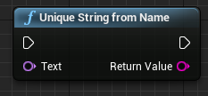 | Blueprint | This is a blueprint wrapper for the `FMD5::HashAnsiString` function, it takes an `FName` as parameter.                                                                                               |
| 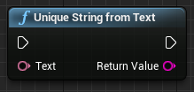 | Blueprint | Same but takes an `FText` as parameter.                                                                                                                                                              |
| 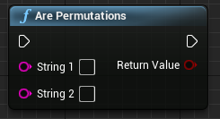           | Blueprint | Compare two strings, checks if the first one is a [permutation](https://en.wikipedia.org/wiki/Permutation) of the second.                                                                            |
| 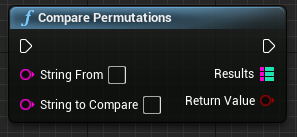   | Blueprint | Same as above + outputs a TMap: keys are each TCHAR of the first string, and values are distances with the same TCHAR in the second string.                                                          |
| 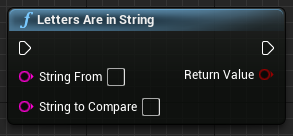     | Blueprint | Only checks if letters from the first string are contained in the second.                                                                                                                            |
| 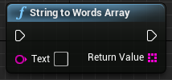     | Blueprint | Will splits every words separated with a space.                                                                                                                                                      |
| 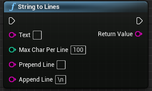     | Blueprint | Will splits text trying to make lines, each line should have a Char length defined in the 2nd argument. This algo will not cut words and always cut line before the word exceeding the chars length. |
| 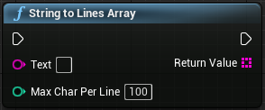               | Blueprint | Same as above but each line will be an array entry.                                                                                                                                                  |
| 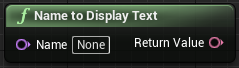       | Blueprint | Convert a name to a display text. Eg: ItIsAName => It Is A Name                                                                                                                                      |
| 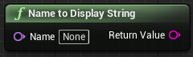   | Blueprint | Same as above but string output.                                                                                                                                                                     |
| `FString WorldTypeToString(const EWorldType::Type Type)`             | CPP       | Usefull for debugging, will output the WorldType Name.                                                                                                                                               |

#### 2.1.2. MathExtension Library

[MathExtensionLibrary.h](./Source/NansUE4Utilities/Public/MathExtensionLibrary.h)

| Node                                                                               | Type      | Goal                                                                                                                                           |
| ---------------------------------------------------------------------------------- | --------- | ---------------------------------------------------------------------------------------------------------------------------------------------- |
| 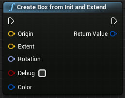   | Blueprint | This will create an FBox (AABB object).  :warning: The Rotation argument will rotate the first cube, but the final result is still an AABB. |
| 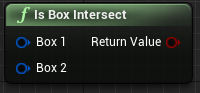                           | Blueprint | Check if 2 boxes intersect.                                                                                                                    |
| 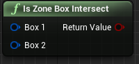                   | Blueprint | A ZoneBox (FZoneBox struct) is coming from the [NansCoreHelpers](https://github.com/NansPellicari/UE4-CoreHelpers) module.                     |
| 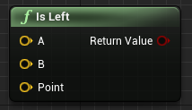                                           | Blueprint | Check if vector A is at the left of the point B using point as reference.                                                                      |
| 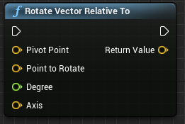           | Blueprint | Rotate a vector using a pivot point and an axis.                                                                                               |
| 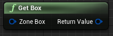                                           | Blueprint | Retrieve the AABB from a FZoneBox.                                                                                                             |
| 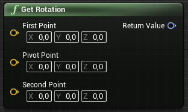                                 | Blueprint | Retrieve the rotation between 2 point and a pivot point.                                                                                       |
| 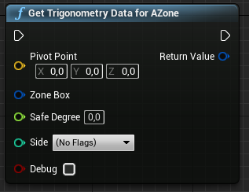 | Blueprint | Returns a [FTrigonometryDataForZone](./Source/NansUE4Utilities/Public/MathExtensionLibrary.h).                                                 |

#### 2.1.3. FlashMessage

[MessageTypes.h](./Source/NansUE4Utilities/Public/MessageTypes.h)

|                                                                               | Type               | Goal                                                                                                         |
| ----------------------------------------------------------------------------- | ------------------ | ------------------------------------------------------------------------------------------------------------ |
| [FNFlashMessage](./Source/NansUE4Utilities/Public/MessageTypes.h)             | Blueprint / Struct | Is a simple Blueprint UStruct embdeding text, duration and priority level data.                              |
| [EFlashMessagePriorityLevel](./Source/NansUE4Utilities/Public/MessageTypes.h) | Blueprint / Enum   | Blueprint UEnum to indicates priority level.                                                                 |
| [FNFlashMessageList](./Source/NansUE4Utilities/Public/MessageTypes.h)         | CPP / Struct       | A simple CPP struct which enqueue messages and prioritize their retrieval depending on their priority level. |

#### 2.1.4. AI: Behavior Tree

|                                                                                                        | Type                    | Goal                                                                                                                                                                                                                       |
| ------------------------------------------------------------------------------------------------------ | ----------------------- | -------------------------------------------------------------------------------------------------------------------------------------------------------------------------------------------------------------------------- |
| [UBTTask_NotifyAIOnAbort](./Source/NansUE4Utilities/Public/AI/BehaviorTree/BTTask_NotifyAIOnAbort.h)   | CPP / Class             | An abstract Behavior Tree Task Node. When it finished in an "Abort" result, it notifies any component implementing [UAITaskAbortAware](./Source/NansUE4Utilities/Public/AI/AITaskAbortAware.h) of the Behavior Tree owner. |
| [UBTTask_NotifyAIOnAbortBP](./Source/NansUE4Utilities/Public/AI/BehaviorTree/BTTask_NotifyAIOnAbort.h) | Blueprint / Class       | The same as above but overrides UBTTask_BlueprintBase instead.                                                                                                                                                             |
| [UAITaskAbortAware](./Source/NansUE4Utilities/Public/AI/AITaskAbortAware.h)                            | CPP & Blueprint / Class | This interface allow any component to be notified by the children nodes of the both above.                                                                                                                                 |

#### 2.1.5. FBPDelegateHandle

[FBPDelegateHandle](./Source/NansUE4Utilities/Public/Misc/BPDelegateHandle.h) is a simple container which allows passing a [FDelegateHandle](https://docs.unrealengine.com/en-US/API/Runtime/Core/Delegates/FDelegateHandle/index.html) through blueprint nodes.

### 2.2. CPP only

#### 2.2.1. Array Utilities

[NansArrayUtils](./Source/NansUE4Utilities/Public/Misc/NansArrayUtils.h)

#### 2.2.2. Error Utilities

| Macro                                       | Goals                                                                                                              |
| ------------------------------------------- | ------------------------------------------------------------------------------------------------------------------ |
| `EDITOR_ERROR(MsgChannel, Text [, Object])` | Will output an error message in the UE editor message panel. Object arg is used to create a link to your object.   |
| `EDITOR_WARN(MsgChannel, Text [, Object])`  | Will output an warning message in the UE editor message panel. Object arg is used to create a link to your object. |
| `SCREEN_LOG(duration, color, format, ...)`  | Log a message to the game screen.                                                                                  |

#### 2.2.3. Comparator Utilities

[NansComparator.h](./Source/NansUE4Utilities/Public/Misc/NansComparator.h).

A bunch of functions allowing data comparisons using blueprint enums ([ENansConditionComparator](./Source/NansUE4Utilities/Public/Misc/NansComparatorHelpers.h) and [ENansConditionOperator](./Source/NansUE4Utilities/Public/Misc/NansComparatorHelpers.h)) and blueprint struct ([FNansConditionOperator](./Source/NansUE4Utilities/Public/Misc/NansComparatorHelpers.h)).  
This way you can easily create a blueprint interface to build data comparison (see [NansDialogueSystem](https://github.com/NansPellicari/UE4-DialogueSystem) for usages).

## 3. Contributing and Supporting

I've decided to make all the code I developed for my games free to use and open source.  
I am a true believer in the mindset that sharing and collaborating makes the world a better place.  
I'll be very glad if you decided to help me to follow my dream.

| How?                                                                                                                                                                               |                                                                                         With                                                                                         |
| :--------------------------------------------------------------------------------------------------------------------------------------------------------------------------------- | :----------------------------------------------------------------------------------------------------------------------------------------------------------------------------------: |
| **Donating**  Because I'm an independant developer/creator and for now I don't have  any income, I need money to support my daily needs (coffeeeeee).                        |  |
| **Contributing**  You are very welcome if you want to contribute. I explain [here](./CONTRIBUTING.md) in details what  is the most comfortable way to me you can contribute. |                                                                         [CONTRIBUTING.md](./CONTRIBUTING.md)                                                                         |

[idialoguehud]: Docs/UIs/IDialogueHUD.md
[uis]: ./Docs/UIs.md
